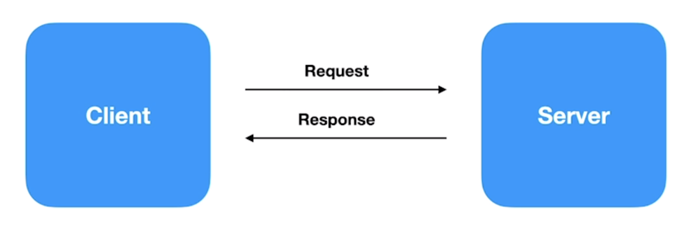

# Unary pattern

This project uses the schema defined in the root (`/proto` and `/pb`) and is based in the same `go.mod` file (also in the root directory).
Either way, this project implements a server using gRPC and Golang, with the Unary (the classic client-server with request-response) pattern.

Read more on my [Handbook](https://cloudy-marsupial-788.notion.site/Unary-example-e7c02f5fcbc94ef3a9b847a33fd7f3b2).

# Directories

- `cmd/client`: Files related to our client
- `cmd/server`: Files related to the initialization of our server
- `services`: Files related to our server's existing services, according to the contracts of our schema
- `../proto`: Our app's schema (entities and contracts)
- `../pb`: Our app's compiled schema

# Commands

- To start the server: `go run ./unary/cmd/server/index.go`
- To start the client: `go run ./unary/cmd/client/index.go`
- To test the server using Evans: `evans -r repl --host localhost --port 50051`

_Read the docs in the root's README to learn more about the project_
